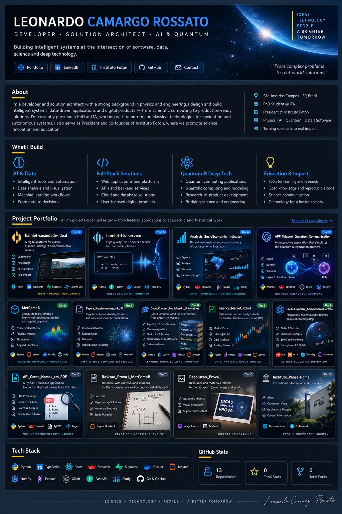

# Leonardo Camargo Rossato

### Developer · Solution Architect · AI & Quantum

**Building intelligent systems, data-driven applications and digital products — from scientific computing to production-ready solutions.**

---

## What I Build

<table>
<tr>
<td width="33%" valign="top">

### AI & Data
Intelligent tools, data analytics, machine learning workflows and decision-support systems designed to transform complex information into usable solutions.

</td>
<td width="33%" valign="top">

### Full-Stack & Architecture
Web applications, APIs, backends and cloud-connected platforms with a focus on clean architecture, maintainability and real-world usability.

</td>
<td width="33%" valign="top">

### Deep Tech
Scientific computing, numerical modeling, autonomous systems and quantum technologies connecting research-grade problems with practical software.

</td>
</tr>
</table>

## Project Portfolio

  

Projects organized by Tier — from featured applications and engineering work to technical, academic and historical repositories.

## Featured Projects

<table>
<tr>
<td width="50%" valign="top">

### 🧠 Hamlet — Sociedade Ideal
**Full-stack digital platform**

A modern web application combining structured content, interactive experiences and AI-enabled services.

`React` `TypeScript` `Vite` `Supabase` `Python` `TTS`

[View repository →](https://github.com/LeonardoCamargoRossato/hamlet-sociedade-ideal)

</td>
<td width="50%" valign="top">

### 📊 Socioeconomic Analytics
**Data Intelligence & Visual Analytics**

Computational tools for exploring socioeconomic indicators through data analysis, interactive visualization and analytical dashboards.

`Python` `Jupyter` `Streamlit` `Data Visualization`

[View repository →](https://github.com/LeonardoCamargoRossato/Analysis_SocioEconomic_Indicator)

</td>
</tr>
<tr>
<td width="50%" valign="top">

### ⚛️ Quantum Teleport Communication
**Interactive Quantum Technology App**

An educational interactive application that simulates the step-by-step process of quantum teleportation between Alice and Bob.

`Python` `Streamlit` `Quantum Computing`

[View repository →](https://github.com/LeonardoCamargoRossato/APP_Teleport_Quantum_Communication)

</td>
<td width="50%" valign="top">

### 🧮 Scientific Computing
**Numerical Modeling & Simulation**

A collection of computational physics and numerical-method projects covering simulations, differential equations, stochastic systems and scientific modeling.

`Python` `Jupyter` `Numerical Methods` `Scientific Computing`

[View repository →](https://github.com/LeonardoCamargoRossato/MetCompB)

</td>
</tr>
</table>

## Technology Stack

## Engineering Profile

`Solution Architecture` · `AI Engineering` · `Full-Stack Development` · `Data & Analytics` · `Scientific Computing` · `Quantum Technologies`

I work at the intersection of **software engineering, artificial intelligence, data and deep tech**, translating complex technical problems into systems, applications and digital products.

My background in physics, computational modeling and research gives me a systems-level approach to engineering: understand the problem deeply, design the architecture, prototype quickly and turn the result into something people can actually use.

## From Science to Software

My path started with scientific computing, numerical modeling and data analysis and progressively expanded into **application development, solution architecture and intelligent systems**.

Today, I am particularly interested in building solutions that connect **AI, autonomous systems, data platforms and quantum technologies**. I am also pursuing a PhD at **Instituto Tecnológico de Aeronáutica (ITA)**, where my research explores hybrid quantum-classical approaches for autonomous navigation in GNSS-denied environments.

---

### Build · Integrate · Solve

*Complex problems deserve usable solutions.*

